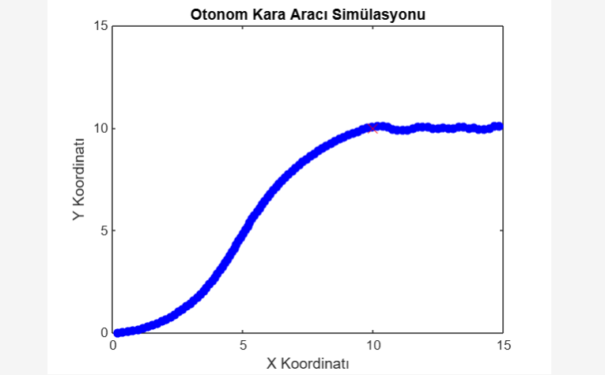

# PID Controller for Autonomous Vehicle

This project implements a **PID controller** to simulate autonomous vehicle navigation. The vehicle uses the **Proportional-Integral-Derivative (PID)** control algorithm to adjust its steering angle and move towards a target point, providing a simulation of how an autonomous vehicle would navigate towards a predefined goal.

### Features
- **PID-based control**: The vehicle uses PID control to adjust its steering angle and reach the target.
- **Real-time simulation**: The vehicle's position and orientation are updated continuously during the simulation.
- **Real-time visualization**: The simulation provides visual feedback, displaying the vehicle's path and target.
- **Customizable parameters**: You can modify vehicle parameters (speed, initial position, etc.) and PID controller gains (Kp, Ki, Kd) to observe different behaviors.

### Project Structure

- **vehiclesimulation.m**: The main MATLAB script that runs the simulation and visualizes the vehicle's movement towards the target.
- **pid_control.m**: Function that implements the PID control algorithm to calculate the steering angle.
- **result.jpg**: Image showing the result of the simulation, with the vehicle's path and target point.

### Installation

1. **Clone the repository:**

   ```bash
   git clone https://github.com/gulkorkut/Autonomous-Ground-Vehicle-Simulation-with-PID-Control.git
   ```

2. **Navigate to the project directory:**

   ```bash
   cd Autonomous-Ground-Vehicle-Simulation-with-PID-Control
   ```

3. **Open and run the `vehiclesimulation.m` file in MATLAB.**

### Usage

1. **Set initial vehicle parameters**:
   - Define the initial position (`x`, `y`) and orientation (`theta`).
   - Set the target coordinates (`target_x`, `target_y`).
   - Choose the vehicle's velocity (`v`).
   - Adjust the PID controller's gains (`Kp`, `Ki`, `Kd`).

2. **Run the simulation**:
   - Execute the `vehiclesimulation.m` file and observe how the vehicle moves towards the target.

3. **Modify parameters**:
   - Experiment with different vehicle speeds, starting positions, and PID values to see how they affect the vehicle's behavior.

## Result

Below is a visualization of the vehicle's path and its movement towards the target point.



## License

This project is licensed under the MIT License.
