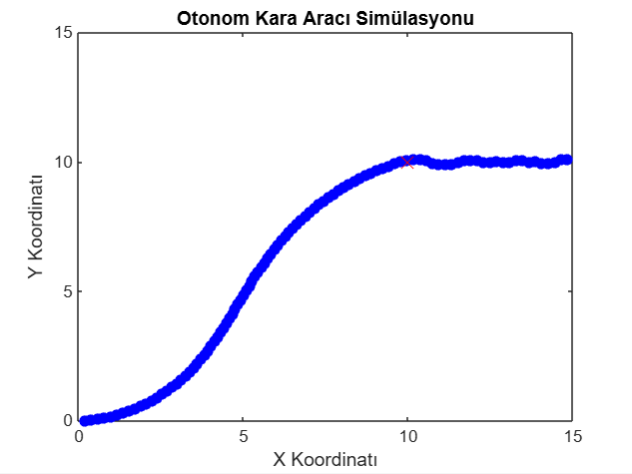

İşte, `result.jpg` görselini ekleyecek şekilde düzenlenmiş README:

---

# PID Controller for Autonomous Vehicle

This project implements a **PID controller** to simulate autonomous vehicle navigation. The vehicle uses PID control to adjust its steering angle and move towards a target point.

## Features

- Simulates vehicle movement using PID control.
- Updates the vehicle's position and orientation in real-time.
- Visualizes the vehicle's path and target on a plot.

## Installation

1. Clone the repository:
   ```
   git clone https://github.com/gulkorkut/Autonomous-Ground-Vehicle-Simulation-with-PID-Control.git
   ```

2. Navigate to the project directory:
   ```
   cd yourrepository
   ```

3. Open and run the `vehiclesimulation.m` file in MATLAB.

## Usage

- Set the initial vehicle parameters such as position, orientation, speed, and PID controller gains.
- Run the simulation to observe how the vehicle moves towards the target point based on the PID controller.
- Modify parameters to test different scenarios and observe the vehicle's behavior.

## Result

Below is a visualization of the vehicle's path and its movement towards the target point.



## License

This project is licensed under the MIT License.
